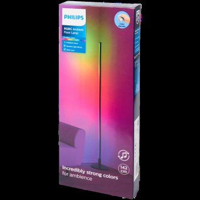
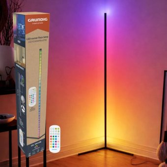
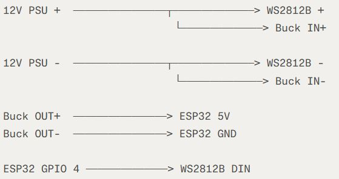
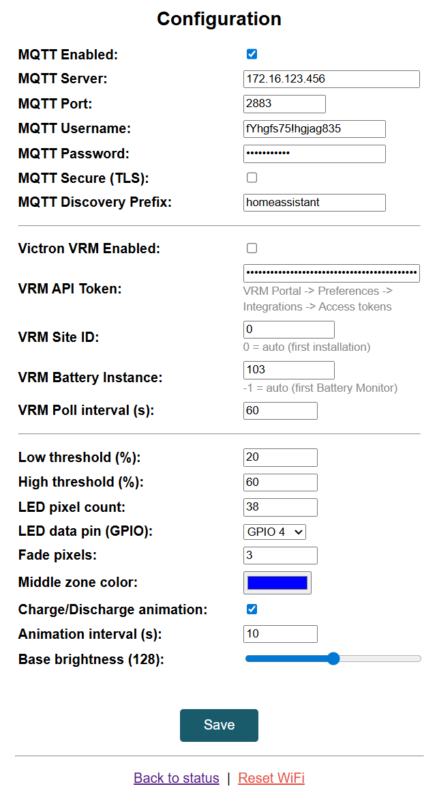

# LEDPowerPercentage

An ESP32-C3 Super Mini firmware that displays a battery/power percentage on any WS2812B LED strip or compatible lamp. The percentage value is received from Domoticz/Home Assistant via MQTT, from the Victron VRM Portal, or set directly through the built-in web interface or REST API.

**Author:** PA1DVB

---

## Hardware

| Component | Value |
|-----------|-------|
| MCU | ESP32-C3 Super Mini |
| LED strip | WS2812B / WS2811 (colour order and signal speed configurable) |
| Default LED count | 38 pixels |
| Default data pin | GPIO 4 |

**Where to buy the ESP32-C3 Super Mini:**
- [AliExpress](https://aliexpress.com/item/1005007783677682.html)
- Search for **"ESP32-C3 Super Mini"** on Amazon

The firmware works with any WS2812B or WS2811-based LED strip or lamp. The pixel colour order (NEO_GRB, NEO_RGB, NEO_RBG, …) and signal speed (800 kHz for WS2812B, 400 kHz for WS2811) are configurable in the web interface without recompilation. Tested with:

| Product | Notes |
|---------|-------|
| Generic WS2812B strip | Any density / length |
| Generic WS2811 strip | Set signal speed to 400 kHz in configuration |
| Philips RGBIC Ambient Floor Lamp (142 cm) | Tap into the WS2812B data line |
| Grundig LED Corner Floor Lamp | Replace the built-in controller with the ESP32-C3 |

<p float="left">
  
  
</p>

> **5 V LED strips (e.g. WS2812B):** Power the ESP32-C3 and the strip directly from a 5 V supply — no converter needed.
>
> **12 V LED strips (e.g. WS2811):** The ESP32-C3 runs on 5 V, so add a **DC-DC Step Down Buck Converter** to step the 12 V rail down to 5 V and power the ESP32 from it — do **not** connect 12 V directly to the board.
> - [DC-DC Step Down Buck Converter (AliExpress)](https://a.aliexpress.com/_EzSliYA)
>
> Wiring diagram for a 12 V setup:
>
> 

The LED strip fills from bottom to top proportional to the percentage value. Three colour zones indicate the charge level:

| Zone | Default range | Colour |
|------|--------------|--------|
| Low | 0 – threshold 1 | Red |
| Middle | threshold 1 – threshold 2 | Configurable (default blue) |
| High | threshold 2 – 100 % | Green |

A configurable fade gradient blends between zones.

---

## Building & Uploading

**IDE:** Arduino IDE with the ESP32 Arduino core installed.

**Board settings (Tools menu):**

| Setting | Value |
|---------|-------|
| Board | `ESP32C3 Dev Module` |
| Partition Scheme | **Minimal SPIFFS (1.9 MB APP with OTA / 128 KB SPIFFS)** |
| Upload Speed | 921600 |
| USB CDC On Boot | **Enabled** — required for Serial Monitor output |
| Serial monitor | 115200 baud |

> The default 1.25 MB partition is too small because `WiFiClientSecure` (used for VRM) adds ~400 KB. Select the **Minimal SPIFFS** scheme to get a 1.9 MB app partition.

**Required libraries** — install all via **Sketch → Include Library → Manage Libraries**:

| Library | Notes |
|---------|-------|
| Adafruit NeoPixel | LED strip control |
| ArduinoJson | JSON serialisation |
| ArduinoOTA | OTA updates |
| PubSubClient | MQTT client |
| WiFiManager (tzapu) | Captive portal |
| WebServer | Built-in ESP32 library |
| SPIFFS | Built-in ESP32 library |

> Modbus TCP uses a raw `WiFiClient` socket — no extra library needed.

**Upload methods:**
- **USB** — first flash; use the normal upload button in Arduino IDE
- **OTA** — after first flash; device appears under **Tools → Port → Network ports** using hostname `LEDPOWER-AABBCCDDEEFF` (password is the same device ID)

---

## First Boot — WiFi Setup

On first boot (or after a WiFi reset) the device opens a captive portal access point named after its device ID (e.g. `LEDPOWER-AABBCCDDEEFF`). Connect to it with any phone or computer — the captive portal should open automatically; if it does not, browse to **http://192.168.4.1** manually. Fill in:

- WiFi SSID / password (selected from a scan list)

All other settings (MQTT, VRM, LED) are configured through the web interface after WiFi is connected.

The portal closes automatically after 180 seconds of inactivity and reboots the device. If the saved WiFi network is slow to boot, the device waits up to 60 seconds before opening the portal.

While in AP mode the bottom ~10 % of the strip breathes blue. While trying to connect to WiFi or MQTT the same pixels show a single orange bouncing dot. Two green blinks confirm a successful WiFi connection.

---

## Web Interface

Once connected, browse to the device IP address (shown on the serial monitor, or find it in your router's DHCP list).

### Status page — `/`

Displays:

- Device ID (including MAC address)
- Firmware version and author
- Current LED state (ON / OFF)
- Current level (%)
- Charging state badge (Idle / Charging / Discharging)
- Active animation name

Controls:

- **Slider** — drag to set the level (0–100 %); the strip updates automatically when you release. Setting to 0 turns the strip off; any value above 0 turns it on.
- **Turn ON / Turn OFF** buttons — toggle without changing the saved level. Turning on at 0 % defaults to 100 %.
- **Idle / Charging / Discharging** buttons — set the charging state animation. Selecting Charging or Discharging automatically turns the strip on if it is off.
- **Animation dropdown** — select an ambient animation from a grouped list (see [Animations](#animations) below). Choosing an animation overrides the colour display; selecting **-- Off --** returns to the normal percentage display.

The status values update every 5 seconds via background fetch without reloading the page. The brightness slider is not overwritten while it is being dragged.

### Configuration page — `/config`

| Setting | Description |
|---------|-------------|
| MQTT Enabled | Enable MQTT — can run alongside any Victron data source |
| MQTT Server | Broker hostname or IP address |
| MQTT Port | Broker port (default 1883; use 8883 for TLS) |
| MQTT Username | Leave blank if not required |
| MQTT Password | Leave blank if not required |
| MQTT Secure (TLS) | Enable TLS encryption (certificate errors are ignored) |
| MQTT Discovery Prefix | Home Assistant / Domoticz discovery prefix (default `homeassistant`) |
| Victron data source | **None** / **VRM (cloud API)** / **Modbus TCP (local)** — radio button |
| VRM API Token | *(VRM only)* Personal access token from VRM Portal → Preferences → Integrations → Access tokens |
| VRM Site ID | *(VRM only)* 0 = auto-select first installation |
| Modbus Host (GX IP) | *(Modbus only)* IP address of the Victron GX device |
| Battery Instance | VRM: -1 = auto. Modbus: unit ID (0 = first battery) |
| Charge threshold (A) | Current above this = Charging (default 0.5 A) |
| Discharge threshold (A) | Current below this = Discharging (default −0.5 A) |
| Poll interval (s) | Seconds between polls, shared by VRM and Modbus (default 60) |
| Low threshold (%) | Upper edge of the red zone |
| High threshold (%) | Lower edge of the green zone |
| LED pixel count | Number of pixels on the strip (1–500) |
| LED data pin (GPIO) | WS2812B data pin — dropdown restricted to valid ESP32-C3 pins |
| Pixel color order | RGB byte order of the strip (default NEO_RBG; most strips use NEO_GRB) |
| LED signal speed | 800 KHz (WS2812B) or 400 KHz (WS2811) |
| Fade pixels | Width of the colour-blend gradient between zones |
| Middle zone color | Colour picker for the middle zone |
| Charge/Discharge animation | Enable/disable the white sweep animation |
| Animation interval (s) | Seconds between animation sweeps (2–60, default 10) |
| Base brightness | Overall strip brightness (0–255) |

Changes to pixel count and GPIO pin take effect immediately. Enabling or disabling MQTT / VRM takes effect immediately after saving — the strip blinks twice to confirm.



### WiFi reset — `/reset`

Clears saved WiFi credentials and reboots into the captive portal.

---

## REST API

The REST API works regardless of whether MQTT is enabled. All endpoints return JSON.

### `GET /api/state`

Returns the current device state.

**Response:**
```json
{
  "state": "on",
  "brightness": 75,
  "charging_state": "idle",
  "animation": "none",
  "ip": "192.168.1.42",
  "rssi": -62
}
```

| Field | Values |
|-------|--------|
| `state` | `"on"` \| `"off"` |
| `brightness` | 0–100 |
| `charging_state` | `"idle"` \| `"charging"` \| `"discharging"` |
| `animation` | `"none"` \| animation name (see [Animations](#animations)) |
| `ip` | current IP address |
| `rssi` | WiFi signal strength in dBm |

**Example:**
```bash
curl http://192.168.1.42/api/state
```

---

### `POST /api/state`

Sets one or more state values. Only the fields you include are changed; omitted fields are left unchanged.

Setting `brightness` to 0 turns the strip off; any value above 0 turns it on.

**Request body (JSON):**
```json
{
  "state": "on",
  "brightness": 60,
  "charging_state": "charging"
}
```

| Field | Type | Values |
|-------|------|--------|
| `state` | string | `"on"` \| `"off"` |
| `brightness` | integer | 0–100 |
| `charging_state` | string | `"idle"` \| `"charging"` \| `"discharging"` |

**Response:** same format as `GET /api/state` with the updated values.

**Examples:**
```bash
# Turn on at 80 %
curl -X POST http://192.168.1.42/api/state \
  -H "Content-Type: application/json" \
  -d '{"state":"on","brightness":80}'

# Set charging state only
curl -X POST http://192.168.1.42/api/state \
  -H "Content-Type: application/json" \
  -d '{"charging_state":"discharging"}'

# Turn off via brightness
curl -X POST http://192.168.1.42/api/state \
  -H "Content-Type: application/json" \
  -d '{"brightness":0}'
```

---

### `POST /api/animation`

Starts or stops an ambient animation on the strip.

**Request body (JSON):**
```json
{"animation": "fire"}
```

| Field | Values |
|-------|--------|
| `animation` | `"none"` \| `"rainbow"` \| `"fire"` \| `"meteor"` \| `"twinkle"` \| `"breathe"` \| `"lava"` \| `"waterfall"` \| `"gradient"` \| `"pulse"` \| `"rain"` \| `"starfield"` \| `"notification"` |

Setting `"none"` stops the animation and returns to the normal percentage display. Any other value starts that animation and overrides the normal display (and clears any active solid-colour override).

**Response:** same format as `GET /api/state` with the updated values.

**Examples:**
```bash
# Start fire animation
curl -X POST http://192.168.1.42/api/animation \
  -H "Content-Type: application/json" \
  -d '{"animation":"fire"}'

# Stop animation
curl -X POST http://192.168.1.42/api/animation \
  -H "Content-Type: application/json" \
  -d '{"animation":"none"}'
```

---

### `POST /api/color`

Fills the entire strip with a single RGB colour immediately. Useful for testing the **Pixel color order** setting — send a pure red, green, or blue and confirm the correct pixels light up.

The effect is temporary; the next state change or animation will restore the normal display.

**Request body (JSON):**
```json
{"r": 255, "g": 0, "b": 0}
```

**Response:**
```json
{"r": 255, "g": 0, "b": 0}
```

**Examples:**
```bash
# Full red
curl -X POST http://192.168.1.42/api/color \
  -H "Content-Type: application/json" \
  -d '{"r":255,"g":0,"b":0}'

# Full green
curl -X POST http://192.168.1.42/api/color \
  -H "Content-Type: application/json" \
  -d '{"r":0,"g":255,"b":0}'

# Strip off
curl -X POST http://192.168.1.42/api/color \
  -H "Content-Type: application/json" \
  -d '{"r":0,"g":0,"b":0}'
```

---

## MQTT / Home Assistant / Domoticz

MQTT is **disabled by default** and is mutually exclusive with Victron VRM — only one can be active at a time. Enable it on the Configuration page, fill in the broker details, and press **Save**. The strip blinks twice to confirm the connection; no reboot is needed.

When enabled, the firmware uses Home Assistant MQTT Auto Discovery and registers four entities automatically.

### Light entity

| Topic | Description |
|-------|-------------|
| `esp32-ledpower/<ID>/status` | Availability (`online` / `offline`) |
| `esp32-ledpower/<ID>/state` | State JSON (read) |
| `esp32-ledpower/<ID>/command` | Command JSON (write) |

**State payload:**
```json
{"state": "ON", "brightness": 75, "charging_state": "idle"}
```

**Command payload** (sent by HA to control the light):
```json
{"state": "ON", "brightness": 60}
```

The `brightness` value is on a 0–100 scale (`brightness_scale: 100`). Setting brightness to 0 via MQTT turns the strip off; any non-zero value turns it on.

### Charging state select entity

| Topic | Description |
|-------|-------------|
| `esp32-ledpower/<ID>/state` | State JSON — read `charging_state` field |
| `esp32-ledpower/<ID>/charging_state/set` | Write `idle` / `charging` / `discharging` |

**Example — set charging state via MQTT:**
```bash
mosquitto_pub -h <broker> \
  -t "esp32-ledpower/LEDPOWER-AABBCCDDEEFF/charging_state/set" \
  -m "charging"
```

### RGB color light entity

A third entity registers as an RGB light. Sending it a colour fills every pixel on the strip with that solid colour, overriding the normal percentage display. Turning it off restores the normal display. The override is also cleared whenever the main light entity receives a new command.

| Topic | Description |
|-------|-------------|
| `esp32-ledpower/<ID>/color/state` | State JSON (read) |
| `esp32-ledpower/<ID>/color/command` | Command JSON (write) |

**State / command payload:**
```json
{"state": "ON", "color": {"r": 255, "g": 0, "b": 0}}
```

**Examples:**
```bash
# Fill strip with red
mosquitto_pub -h <broker> \
  -t "esp32-ledpower/LEDPOWER-AABBCCDDEEFF/color/command" \
  -m '{"state":"ON","color":{"r":255,"g":0,"b":0}}'

# Restore normal display
mosquitto_pub -h <broker> \
  -t "esp32-ledpower/LEDPOWER-AABBCCDDEEFF/color/command" \
  -m '{"state":"OFF"}'
```

### Animation select entity

A fourth entity registers as a select entity for controlling ambient animations.

| Topic | Description |
|-------|-------------|
| `esp32-ledpower/<ID>/animation/state` | Current animation name (plain text, read) |
| `esp32-ledpower/<ID>/animation/set` | Set animation by name (plain text, write) |

**Options:** `none`, `rainbow`, `fire`, `meteor`, `twinkle`, `breathe`, `lava`, `waterfall`, `gradient`, `pulse`, `rain`, `starfield`, `notification`

**Example — start the fire animation via MQTT:**
```bash
mosquitto_pub -h <broker> \
  -t "esp32-ledpower/LEDPOWER-AABBCCDDEEFF/animation/set" \
  -m "fire"
```

The device ID is `LEDPOWER-` followed by the full 6-byte MAC address in uppercase hex (visible on the status page and in the serial log).

---

## Animations

### System animations

| Situation | Animation |
|-----------|-----------|
| AP mode (captive portal open) | Bottom ~10 % of strip: slow blue breathing |
| Connecting to WiFi / MQTT | Bottom ~10 % of strip: single orange bouncing pixel |
| WiFi connected | Bottom ~10 % of strip: two green blinks |
| MQTT or VRM enabled / disabled on config save | Two green blinks |
| Charging state active | Single white pixel sweeping upward, repeating at the configured interval |
| Discharging state active | Single white pixel sweeping downward, repeating at the configured interval |
| Idle state | No animation |

- The charge/discharge animation starts immediately when the state is set, then repeats at the configured interval (default 10 s, range 2–60 s).
- The animation only runs when the LED strip is ON and **Charge/Discharge animation** is enabled in the configuration.
- Switching between Charging and Discharging resets and restarts the sweep immediately.

### Ambient / relaxing animations

User-selectable animations available from the web UI dropdown, REST API, or MQTT. Selecting any animation overrides the normal percentage display and the charge/discharge sweep for the duration. Selecting **none** (or `"none"` via API/MQTT) returns to the normal display.

| Name | Description |
|------|-------------|
| `rainbow` | Continuous hue-cycle scrolling across all pixels |
| `fire` | Flickering red/orange fire effect rising from the base |
| `meteor` | Bright comet with a fading trail shooting upward repeatedly |
| `twinkle` | Random pixels sparkle on and off in warm white |
| `breathe` | Whole strip fades in and out in soft white |
| `lava` | Slow-moving blobs of colour drifting up and down |
| `waterfall` | Cyan droplets falling from top to bottom |
| `gradient` | Slow animated gradient cycling through hues |
| `pulse` | Rapid colour pulses rippling across the strip |
| `rain` | Blue rain drops falling at random positions |
| `starfield` | Stars appearing and slowly fading out |
| `notification` | Two quick amber pulses then a pause — mimics the Alexa notification ring |

Setting a solid colour via `/api/color` or the MQTT colour entity also clears any active animation. Starting an animation clears any active solid colour override.

---

## OTA Firmware Update

OTA (Over-The-Air) updates are supported via the Arduino IDE or `espota.py`.

- **Hostname:** device ID (e.g. `LEDPOWER-AABBCCDDEEFF`)
- **Password:** same as the device ID

In the Arduino IDE, the device appears under **Tools → Port → Network ports** after a few seconds.

---

## Serial Log

On boot the device prints a summary to the serial port (115200 baud):

```
App version:  2026.04.24 rev 1.0
LED pin:      GPIO4,  pixels: 38
CPU freq:     160 MHz
Device ID:    LEDPOWER-AABBCCDDEEFF
MQTT availability: esp32-ledpower/LEDPOWER-AABBCCDDEEFF/status
WiFi: connecting...
WiFi: connected.  IP: 192.168.1.42  RSSI: -58 dBm
```

If MQTT is enabled, connection attempts are also logged with the PubSubClient state code on failure.

---

## Configuration Storage

All settings are stored in SPIFFS as `/config.json`. If the filesystem cannot be mounted it is formatted automatically and all settings reset to defaults.

| Setting | Default |
|---------|---------|
| mqtt_enabled | false |
| mqtt_secure | false |
| mqtt_server | `example.tld` |
| mqtt_port | 1883 |
| mqtt_username | *(empty)* |
| mqtt_password | *(empty)* |
| mqtt_discovery_prefix | `homeassistant` |
| vrm_enabled | false |
| vrm_api_token | *(empty)* |
| vrm_site_id | 0 (auto) |
| vrm_battery_instance | -1 (auto) |
| vrm_charge_threshold | 0.5 |
| vrm_discharge_threshold | -0.5 |
| vrm_interval | 60 |
| threshold_1 | 20 |
| threshold_2 | 60 |
| fade_pixels | 3 |
| num_pixels | 38 |
| led_pin | 4 |
| pixel_color_order | 9 (NEO_RBG) |
| pixel_khz | 800 |
| middle_r / g / b | 0 / 0 / 255 (blue) |
| charge_anim | true |
| charge_anim_interval | 10 |
| base_brightness | 128 |

---

## Victron VRM Integration

The firmware can poll the [Victron VRM Portal](https://vrm.victronenergy.com) for battery state-of-charge (SOC) and current, and update the LED strip automatically.

### Setup

1. Log in to the VRM Portal and navigate to **Preferences → Integrations → Access tokens**.
2. Click **Add**, give the token a name (e.g. `LEDPower`), and copy it immediately — it cannot be retrieved again.
3. Open the device configuration page, enable **Victron VRM**, paste the token into **VRM API Token**, and optionally enter a **VRM Site ID** (leave at 0 to auto-select the first installation).
4. Optionally set **VRM Battery Instance** if you have multiple battery monitors and the auto-selected one is wrong (leave at -1 to auto-select the first Battery Monitor found).
5. Set the **VRM Poll interval** (default 60 s) and press **Save**. The strip blinks twice to confirm; no reboot is needed.

### Behaviour

| VRM field | LED effect |
|-----------|-----------|
| SOC (%) | Sets the LED level (0 = strip off, 1–100 = strip on at that %) |
| Current > charge threshold | Charging state → **Charging** |
| Current < discharge threshold | Charging state → **Discharging** |
| Current between both thresholds | Charging state → **Idle** |

Serial log messages are prefixed with `[VRM]`.

---

## Modbus TCP Integration

The firmware can read battery state directly from a **Victron GX device** (Cerbo GX, Venus GX, CCGX, …) over Modbus TCP on the local network — no internet or VRM account required.

### Setup

1. On the GX device, go to **Settings → Services → Modbus TCP** and enable it.
2. Note the GX device's IP address (assign a static IP via your router's DHCP reservation).
3. Open the device configuration page, select **Modbus TCP (local)** as the Victron data source, enter the GX IP in **Modbus Host**, and press **Save**.

### Registers used

All reads target `com.victronenergy.battery` (holding registers):

| Register | Description | Type | Scale | Unit |
|----------|-------------|------|-------|------|
| 266 | State of charge | uint16 | ÷10 | % |
| 261 | Current | int16 | ÷10 | A |

The **unit ID** defaults to `0` (first battery monitor). Set **Battery Instance** to the device instance number if you have multiple battery monitors.

Charging state is derived from current using the shared charge/discharge thresholds (same as VRM).

Serial log messages are prefixed with `[Modbus]`.

---

## Dependencies (Arduino Libraries)

Install via the Arduino Library Manager:

| Library | Purpose |
|---------|---------|
| Adafruit NeoPixel | WS2812B LED control |
| ArduinoJson | JSON serialisation |
| ArduinoOTA | OTA firmware updates |
| PubSubClient | MQTT client |
| WiFiManager (tzapu) | Captive portal WiFi setup |
| WebServer (built-in) | HTTP server |
| SPIFFS (built-in) | Filesystem for config storage |

Board: **ESP32C3 Dev Module** (or compatible) via the ESP32 Arduino core.

> **Partition scheme:** The sketch exceeds the default 1.25 MB app partition because `WiFiClientSecure` (used by the Victron VRM integration) pulls in the mbedTLS library (~400 KB). In the Arduino IDE select **Tools → Partition Scheme → Minimal SPIFFS (1.9MB APP with OTA/190KB SPIFFS)** before uploading. This keeps OTA support and provides ample space for `config.json` in SPIFFS.

---

## Project Structure

```
LEDPowerPercentage/
├── LEDPowerPercentage.ino   # Main file: globals, setup(), loop()
├── Config.h                 # All persistent settings + SPIFFS load/save
├── LEDControl.ino           # LED rendering, colour zones, charge/discharge sweep
├── Animations.ino           # Ambient animation engine (11 animations)
├── MQTTAutoDiscovery.ino    # MQTT state publishing, HA auto-discovery, command callback
├── WebServer.ino            # Web UI handlers + REST API
└── WiFiMqttSetup.ino        # WiFi captive portal, OTA, MQTT reconnect
```
